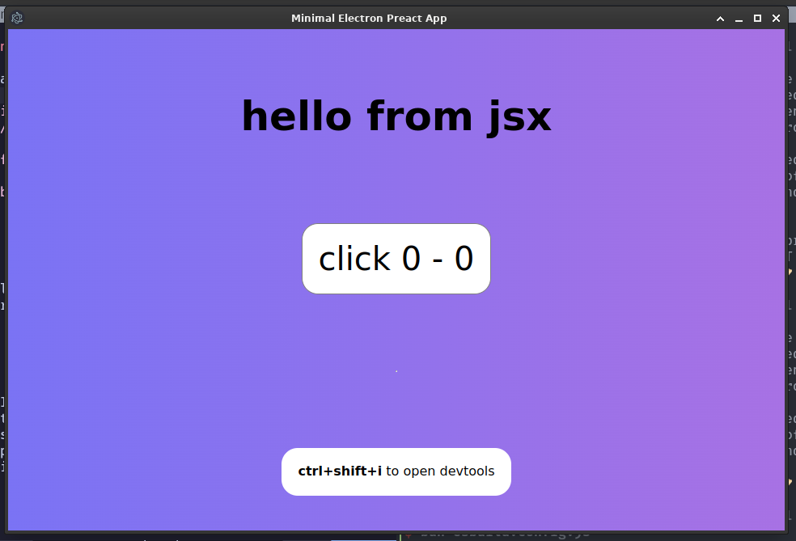

# bun-electron-esbuild-preact



> a super minimal electron with preact jsx, goober (css-in-js), and @preact/signals

> also, rxjs for advanced state management

- clone it
- bun install
- bun run build -> `bun run esbuild.config.js`
- bun run start -> `bun run build && bun run electron ./index.html`
- enjoy

## todos

- [ ] integrate preact router
- [ ] global stores with rxjs 
- [ ] sqlite persistent

## examples

```jsx 
import { h, render, Fragment } from 'preact';
import {signal, computed, effect} from "@preact/signals"
import {styles} from "./App.styles.js"

export function App() {
    const count = signal(0)
    const double = computed(() => count.value * 2) 

    const increment = () => count.value++

    effect(() => {
        console.log("count: ", count.value);
        console.log("double: ", double.value);
    })

    return (
        <div className={`${styles.container} ${styles.animateBg}`}>
            <div className={styles.header}>hello from jsx</div>
            <button className={styles.btn} onClick={increment}>
              click {count} - {double}
            </button>
        </div>
    )
}
```

```js 
import {css} from "goober"

export const styles = {
    container: css`
        display: grid;
        place-items: center;
        align-items: center; 
        text-align: center;
        min-height: 620px;
        max-height: 620px;
        font-family: sans;
    `,
    header: css`
        font-weight: bold;        
        font-size: 50px;
        padding: 40px 0 20px 0;
    `,
    btn: css`
        font-size: 40px;
        border: 1px solid gray;
        border-radius: 10px;
        padding: 20px;
        background: white;

        &:hover { background: lightgray; }
    `,
    animateBg: css`
      @keyframes gradientShift {
        0% { background-position: 0% 50%; }
        50% { background-position: 100% 50%; }
        100% { background-position: 0% 50%; }
      }

      background: linear-gradient(270deg, #ff6ec4, #7873f5, #4ade80);
      background-size: 600% 600%;
      animation: gradientShift 8s ease infinite;
    `
}

```
